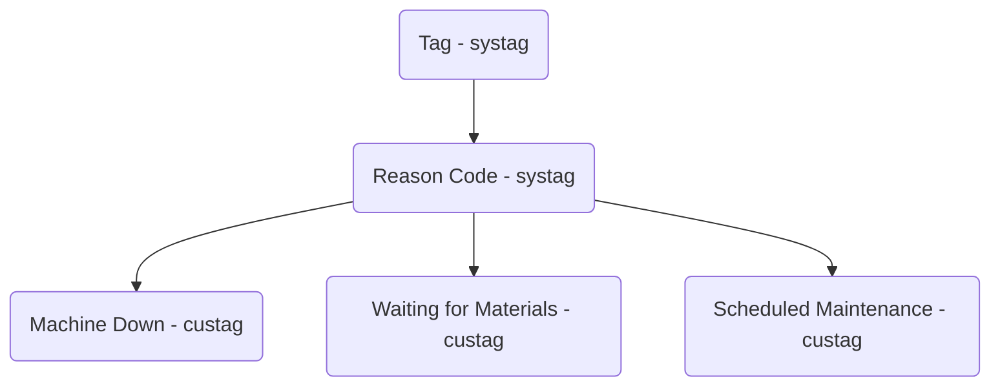

# Runtime

## Create a demo customer

```sql
begin
;

select *
from
    runtime.create_demo(
        customer_name := 'Frozen Tendy Factory',
        admins := array[
            'worker_d3ebf472-606c-4d26-9a19-d99f187e9c92',
            'worker_a5d1d16f-4264-45e7-97c6-1ef534b8875f'
        ],
        modified_by := 895
    )
;

commit
;
```

## Reason codes, e.g. for Downtime and Idle Time

Design:

- Reason codes are an "enum" - the set of codes is defined albeit extensible.
- Internally, they are just Strings with result-level constraints controlling
  the values.
- They are _still results_.



Frontend:

The Field.completions field can be used to fetch the initial list.
The resulting edges will be in custagorder (which you control).

```graphql
... on Task {
  fields {
    edges {
      node {
        # allowedValues {
        completions { # ValueCompletionConnection
          edges {     # ValueCompletionEdge
            node {    # ValueCompletion
              value { # Value
                __typename
                ... on StringValue {
                  string
                }
              }
            }
          }
        }
      }
    }
  }
}
```

```jsx
<select>
  {data.field.completions.edges.map(e => (
    <option value={e.node.value.string}>
      {e.node.value.string}
    </option>
  )}
</select>
```
