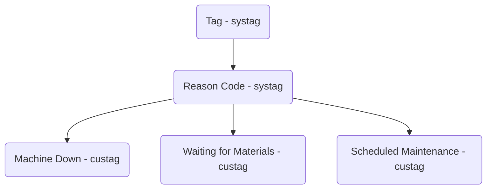
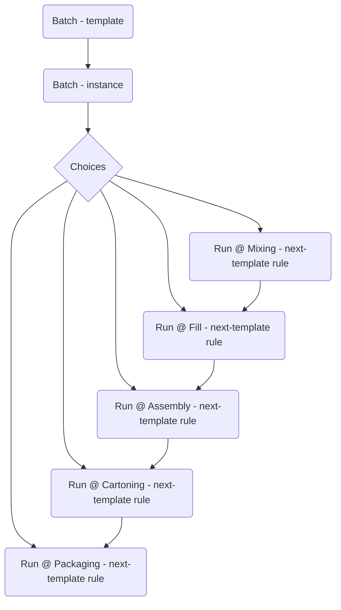

# Runtime

## Create a demo customer

```sql
begin;

select *
from runtime.create_demo(
  customer_name := 'Frozen Tendy Factory',
  admins := (
    select array_agg(workeruuid)
    from public.worker
    where workeridentityid = :YOUR_USER_ID
  ),
  modified_by := 895
);

commit;
```

## Reason codes, e.g. for Downtime and Idle Time

Design:

- Reason codes are an "enum" - the set of codes is defined albeit extensible.
- Internally, they are just Strings with result-level constraints controlling
  the values.
- They are _still results_.



Frontend:

The Field.completions field can be used to fetch the initial list.
The resulting edges will be in custagorder (which you control).

```graphql
... on Task {
  fields {
    edges {
      node {
        # allowedValues {
        completions { # ValueCompletionConnection
          edges {     # ValueCompletionEdge
            node {    # ValueCompletion
              value { # Value
                __typename
                ... on StringValue {
                  string
                }
              }
            }
          }
        }
      }
    }
  }
}
```

```jsx
<form>
  <label for="value">Select Reason</label>
  <select id="value" name="value">
    {data.field.completions.edges.map((e) => (
      <option value={e.node.value.string}>{e.node.value.string}</option>
    ))}
  </select>
</form>
```

## Batch

### Setup

Until Batch has been released, you will need to create the necessary template
type (i.e. systag) manually, e.g.:

```sql
begin;

select 1
from auth.set_actor(:YOUR_IDENTITY_ID, 'en');

select 1
from ast.create_system_type('Batch', 'Template Type', 895);

commit;
```

Note that `create_system_type` is not idempotent :( sorry.

### Design

Batch is built on the Task backend, i.e. workinstance/template. There is a new
model for this in the works, which is what the `instances` and `templates`
entrypoints will eventually use however until then they are just dumb mappings.

In general, the only thing that differs about a Batch vs a Run (or Idle or Down)
is the worktemplatetype, i.e. 'Batch'. This is what the `withImplementation`
argument to the below "List batches" query is doing[^2].

Ultimately it is up to you to decide how exactly you want to organize things. I
_suggest_ that you model Batches as part of the `chain`. Put the Batch at the
root and all of the Run instances are children. This is what the test suite
does. The benefit of this is that aggregation becomes very easy (and fast), and
the normal `chainAgg` interface will give you aggregate time spent in each task
type _for a single Batch, across all Locations_ (which I suppose is really only
helpful on the "Batch detail page" but still).

### Frontend

List batches:

```graphql
query BatchesViewConsoleQuery {
  trackables(withImplementation: "Batch") { # => maps to worktemplatetype!
    edges {
      node {
        # This is the Batch (workinstance).
        ... on Task {
          name {
            value # Batch ID
          }
          fields {
            # Customer, Product Name, SKU, etc
          }
          parent {
            # Note that this is useless for how Batch will be configured.
            # It will always be the "site" due to historical constraints.
            # The frontend will need to accomodate this else it will show the
            # site name rather than the "active location". It should instead
            # grab the location from the active task. Assuming that is the
            # desired UX. Kinda depends how you intend for the app to be used
            # in "batch tracking" mode. See further down "UX design decisions".
          }
          fsm {
            # We are back to normal Runtime now; this is the canonical
            # StateMachine<Task> interface.
            active {
              parent {
                # The "active location". What is shown at the top of the
                # in-progress screen, currently that is.
              }
            }
            transitions {
              edges {
                # In the new model, these are actually worktemplatenexttemplates.
                id # worktemplatenexttemplateuuid
                conditions {
                  # These would be viaworkresultid, viastatuschangeid, etc
                  # I will plumb these through primarily for debugging and testing.
                }
                node {
                  # This is the normal Task (worktemplate).
                }
                target {
                  # This is the target location, if any.
                }
              }
            }
          }
        }
      }
    }
  }
}
```

Note: the frontend will need to start passing the `transitions.edges.id` to
`advance`, rather than the `transitions.edges.node.id` as is currently the case.

Creating batches:

You will need the Batch template in addition to the Fields. In the console you
could put this in the page query or even better the "add batch" button. You can
find an example of this in [EnabledLanguage.tsx#L259] (although you probably
want some more like [^1]). Similarly in the mobile app it could go in the drawer
or wherever the "create a new batch" component is.

As far as the query is concerned, you should get only a single edge back.

```graphql
query {
  templates(owner: $customerId, type: ["Batch"]) {
    edges {
      node {
        asTask {
          id # henceforth: $batchTemplateId
          fields {
            edges {
              node {
                id # e.g. for `key` prop
                ...FieldInput_fragment
              }
            }
          }
        }
      }
    }
  }
}
```

This is the mutation that you will call to actually create a new Batch.

```graphql
mutation {
  createInstance(
    template: { id: $batchTemplateId }
    name: "12345" # or whatever
    fields: [
      { id: "...", value: { string: "Ross's Salsa" } }
      { id: "...", value: { string: "Medium Red Salsa" } }
      { id: "...", value: { id: "SLS-RED-ME" } }
    ]
  ) {
    edge @appendEdge(connections: $connections) {
      ...BatchListRow_fragment
    }
  }
}
```

### Test suite

The test suite (batch.test.ts) configures batch like so:



which is to say:

- When you close a Run instance of a Batch, it will move to Open at the "next"
  location: Mixing > Fill > Assembly > Cartoning > Packaging. I do this in the
  test suite to test eager cross-location instantiation.
- Given an InProgress Batch instance, you can create an InProgress Run instance
  of the Batch at any of the locations. This is to test lazy cross-location
  instantiation.

This may or may not be how you want things to work. Have a look at
[batch.test.ts](../test/app/runtime/batch.test.ts#L593) for how this is all
setup. You can modify the test suite to achieve the specific configuration you
want if different.

### UX design decisions:

- Will the app be used in a "location first" workflow? Or will it be used in a
  "batch first" workflow?

This affects where you get the `parent` from in the above query. If the intent
is a location-first workflow then you should always grab the active's parent,
and fall back to the fsm's parent if there is no active. The mocks seem to
suggest this sort of workflow since batch selection happens _after_ line
selection.

If however you'd like a batch-first workflow, then you should get the `parent`
from the root node (which is the batch); the effect being that the title of the
in-progress screen will show the batch id.

Perhaps a nice dynamic solution to accomodate both workflows is merge both of
the parents into the header, but only if they are different, to the effect of:

```
----------------------------------------------------------------------
| <                    12345 @ Cartoning Line                   (MH) |
|                          o Not Started                             |
----------------------------------------------------------------------
```

or, e.g. in the case of non-batch-mode:

```
----------------------------------------------------------------------
| <                       Cartoning Line                        (MH) |
|                          o Not Started                             |
----------------------------------------------------------------------
```

```typescript
const header =
  !active || active.parent.id === node.parent.id
    ? `${node.parent.name.value}` // e.g. just Cartoning Line
    : `${node.parent.name.value} @ ${active.parent.name.value}`;
```

- Localization of batch ids?

Not sure what the batch numbers are aside from being customer defined, but you
potentially may want them to remain untranslated. This would happen in the
database as part of customer create, i.e. setting the translation status of the
worktemplate's name to 'NEVER_TRANSLATE' or whatever.

- User-driven cross-location instantiation?

You could have a UX wherein the user is presented with all of the cross-location
instantiation options, and they select the right one to do. Perhaps there are
batch workflows where "branching" can occur? Idk, but just know that this can be
done. You could even mix and match. Maybe eager instantiation happens from A to C
and then there is an option to advance into D, E, or F, and then eagerly through
H, which is the final step. Note also that this has nothing to do with Batch,
but rather is a side effect of implementing Batch (i.e. cross location
instantiation).

[EnabledLanguage.tsx#L259]: https://github.com/tendrelhq/console/blob/f9d4f6cee6bc8dc31506f7f53e99082a9786f78f/src/app/(app)/(home)/languages/EnabledLanguage.tsx#L259

[^1]:
    ```diff
    diff --git a/src/app/(app)/(home)/languages/EnabledLanguage.tsx b/src/app/(app)/(home)/languages/EnabledLanguage.tsx
    index 5c6b7b2..f693095 100644
    --- a/src/app/(app)/(home)/languages/EnabledLanguage.tsx
    +++ b/src/app/(app)/(home)/languages/EnabledLanguage.tsx
    @@ -295,18 +295,25 @@ function AddLanguageButton(props: { connectionId: string }) {
         <Dialog
           open={open}
           onOpenChange={open => {
    -        if (open) {
    +        // If the queryRef does not exist then the data is not present in the
    +        // store, i.e. it has not been loaded. In such cases we want to load the
    +        // query within a transition so we can capture the loading state and
    +        // display a nice spinner to the user. When the queryRef *does* exist,
    +        // the data is present in the store. In such cases calling loadQuery()
    +        // is effectively a no-op but we don't want to blindly do this in a
    +        // transition since it will *still trigger the loading state* and you
    +        // will see the spinner flash on screen before the dialog opens.
    +        if (open && !queryRef) {
               startTransition(() => {
    +            // Load and then open.
                 loadQuery({});
                 setOpen(true);
               });
    -        }
    -        // TODO: not sure if this is what we want, but playing around with it
    -        // for now. From the docs: calling dispose() implies "the data is liable
    -        // to be garbage collected". Key word "liable"... not sure so we'll see.
    -        else {
    -          dispose();
    +        } else if (open) {
    +          setOpen(true);
    +        } else {
               setOpen(false);
    +          dispose();
             }
           }}
           modal
    ```

[^2]:
    This _is_ specific to Batch. Passing `Location` (the default) or `Task`
    does _not_ map to worktemplatetype. This is a WIP move to the new model.
