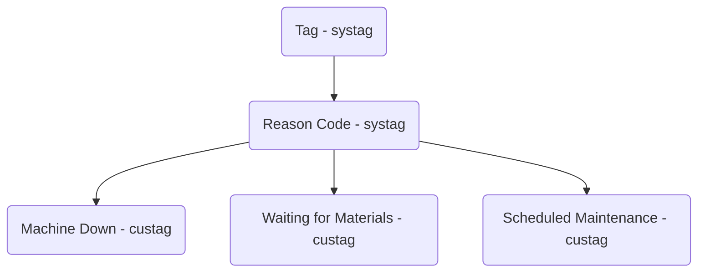
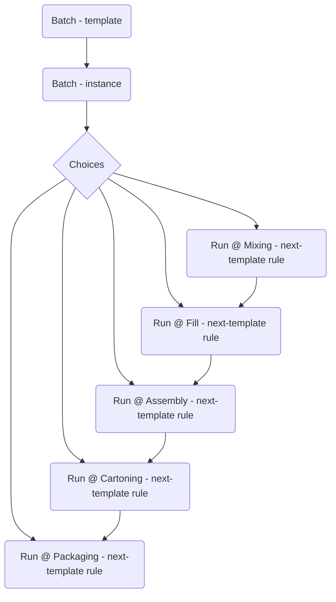

# Runtime

## Create a demo customer

```sql
begin;

select *
from runtime.create_demo(
  customer_name := 'Frozen Tendy Factory',
  admins := (
    select array_agg(workeruuid)
    from public.worker
    where workeridentityid = :YOUR_USER_ID
  ),
  modified_by := 895
);

commit;
```

## Reason codes, e.g. for Downtime and Idle Time

Design:

- Reason codes are an "enum" - the set of codes is defined albeit extensible.
- Internally, they are just Strings with result-level constraints controlling
  the values.
- They are _still results_.



Frontend:

The Field.completions field can be used to fetch the initial list.
The resulting edges will be in custagorder (which you control).

```graphql
... on Task {
  fields {
    edges {
      node {
        # allowedValues {
        completions { # ValueCompletionConnection
          edges {     # ValueCompletionEdge
            node {    # ValueCompletion
              value { # Value
                __typename
                ... on StringValue {
                  string
                }
              }
            }
          }
        }
      }
    }
  }
}
```

```jsx
<form>
  <label for="value">Select Reason</label>
  <select id="value" name="value">
    {data.field.completions.edges.map((e) => (
      <option value={e.node.value.string}>{e.node.value.string}</option>
    ))}
  </select>
</form>
```

## Batch

Database changes:

```sql
-- Allows for cross-location instantiation.
alter table public.worktemplatenexttemplate
add column worktemplatenexttemplateprevlocationid text
    references public.location (locationuuid),
add column worktemplatenexttemplatenextlocationid text
    references public.location (locationuuid),
add column worktemplatenexttemplateuuid text
    not null unique default gen_random_uuid()
;
```

Frontend (query):

```graphql
query BatchesViewConsoleQuery {
  trackables(withImplementation: "Batch") { # => maps to worktemplatetype!
    edges {
      node {
        # This is the Batch (workinstance).
        ... on Task {
          name {
            value # User supplied "batch id/number/name/whatever"
          }
          fields {
            # Customer, Product Name, SKU, etc
          }
          parent {
            # Note that this is useless for how Batch will be configured.
            # It will always be the "site" due to historical constraints.
            # The frontend will need to accomodate this else it will show the
            # site name rather than the "active location". It should instead
            # grab the location from the active task. Assuming that is the
            # desired UX. Kinda depends how you intend for the app to be used
            # in "batch tracking" mode. See further down "UX design decisions".
          }
          fsm {
            # We are back to normal Runtime now; this is the canonical
            # StateMachine<Task> interface.
            active {
              parent {
                # The "active location". What is shown at the top of the
                # in-progress screen, currently that is.
              }
            }
            transitions {
              edges {
                # In the new model, these are actually worktemplatenexttemplates.
                id # worktemplatenexttemplateuuid
                conditions {
                  # These would be viaworkresultid, viastatuschangeid, etc
                  # I will plumb these through primarily for debugging and testing.
                }
                node {
                  # This is the normal Task (worktemplate).
                }
                target {
                  # This is the target location, if any.
                }
              }
            }
          }
        }
      }
    }
  }
}
```

NOTE: The frontend will need to start passing the `transitions.edges.id` to
`advance`, rather than the `transitions.edges.node.id` as is currently the case.
This really only matters in the event of _cross location instantiation_, and
only if you _want_ this instantiation to be user-driven vis-a-vis downtime and
idle time. You can of course configure instantiation to happen automatically
(i.e. eager) in which case the user would do nothing.

Frontend (mutation):

```graphql
query ListTemplateTypesQuery {
  # If you don't provide an `id` argument, you will get back the "root"
  # template. You can think of this as being similar to "systag 1". Taking that
  # comparision literally would yield things like Language, Timezone, Result
  # Status, Reason Code, etc. However note that this API is driven by the entity
  # model and is not limited to just systags.
  # types: root(kind: "template") {
  # -or-
  types: template {
    # Grab the id of the top-level string type. We'll use it to create the SKU
    # type later on. You may want to explicitly grab the system-owned type, or
    # you may not. Note that a similar phenomenon to TypeScript's "declaration
    # merging" feature occurs at the template/type level: identical types at the
    # same level of the tree are merged. This allows for type composition. Note
    # that you can only _add_ to a type. You cannot "remove a field" or "change
    # a field's type", for example.
    # N.B. `system` is an alias for "customer 0". It is only used here for
    # demonstration purposes.
    string: child(type: "String", owner: "system") {
      id # $stringTypeId
    }
    # In a full-fledged template editing experience, you might instead grab all
    # of the top-level types and let the user choose.
    all: children {
      edges {
        node {
          id
          name {
            value # Translated, e.g. "Boolean", "Number", "Reason Code", "String", etc
          }
          type # Never translated.
        }
      }
    }
  }
}
```

```jsx
<form>
  <label for="fieldType">Field Type:</label>
  <select id="fieldType" name="fieldType">
    {types.all.edges.map((e) => (
      <option value={e.node.id}>{e.node.name.value}</option>
    ))}
  </select>
</form>
```

```graphql
mutation CreateBatchMutation {
"""
This will eventually be the API. For now, you can do the same thing you do for
Reason Codes to achieve pre-defined SKUs, if that is what you want.

  # Create a SKU type. This would be useful if, as with Reason Codes, you wanted
  # to confine the set of available SKUs rather than allowing arbitrary strings.
  createTemplate(name: "SKU", type: $stringTypeId) {
    edge {
      node {
        id # $skuTypeId
      }
    }
  }
"""

  # Create a Batch type.
  createTemplate(
    name: "Batch"
    fields: [
      { name: "Customer", valueType: "string" }
      { name: "Product Name", valueType: "string" }
      { name: "SKU", valueType: "string" }
    ]
  ) {
    edge {
      node {
        id # $batchTemplateId
      }
    }
  }

  # Create some batches.
  createInstance(
    template: { id: $batchTemplateId }
    name: "12345"
    fields: [
      { id: $customerFieldId, value: { string: "Ross's Salsa" } }
      { id: $productNameFieldId, value: { string: "Medium Red Salsa" } }
      { id: $skuFieldId, value: { id: "SLS-RED-ME" } }
    ]
  ) {
    edge @appendEdge(connections: $connections) {
      ...BatchListRow_fragment
    }
  }
}
```



### UX design decisions:

- Will the app be used in a "location first" workflow? Or will it be used in a
  "batch first" workflow?

This affects where you get the `parent` from in the above query. If the intent
is a location-first workflow then you should always grab the active's parent,
and fall back to the fsm's parent if there is no active. The mocks seem to
suggest this sort of workflow since batch selection happens _after_ line
selection.

If however you'd like a batch-first workflow, then you should get the `parent`
from the root node (which is the batch); the effect being that the title of the
in-progress screen will show the batch id.

Perhaps a nice dynamic solution to accomodate both workflows is merge both of
the parents into the header, but only if they are different, to the effect of:

```
----------------------------------------------------------------------
| <                    12345 @ Cartoning Line                   (MH) |
|                          o Not Started                             |
----------------------------------------------------------------------
```

or, e.g. in the case of non-batch-mode:

```
----------------------------------------------------------------------
| <                       Cartoning Line                        (MH) |
|                          o Not Started                             |
----------------------------------------------------------------------
```

```typescript
const header =
  !active || active.parent.id === node.parent.id
    ? `${node.parent.name.value}` // e.g. just Cartoning Line
    : `${node.parent.name.value} @ ${active.parent.name.value}`;
```

- Localization of batch ids?

Not sure what the batch numbers are aside from being customer defined, but you
potentially may want them to remain untranslated. This would happen in the
database as part of customer create, i.e. setting the translation status of the
worktemplate's name to 'NEVER_TRANSLATE' or whatever.

- User-driven cross-location instantiation?

You could have a UX wherein the user is presented with all of the cross-location
instantiation options, and they select the right one to do. Perhaps there are
batch workflows where "branching" can occur? Idk, but just know that this can be
done. You could even mix and match. Maybe eager instantiation happens from A to C
and then there is an option to advance into D, E, or F, and then eagerly through
H, which is the final step. Note also that this has nothing to do with Batch,
but rather is a side effect of implementing Batch (i.e. cross location
instantiation).
